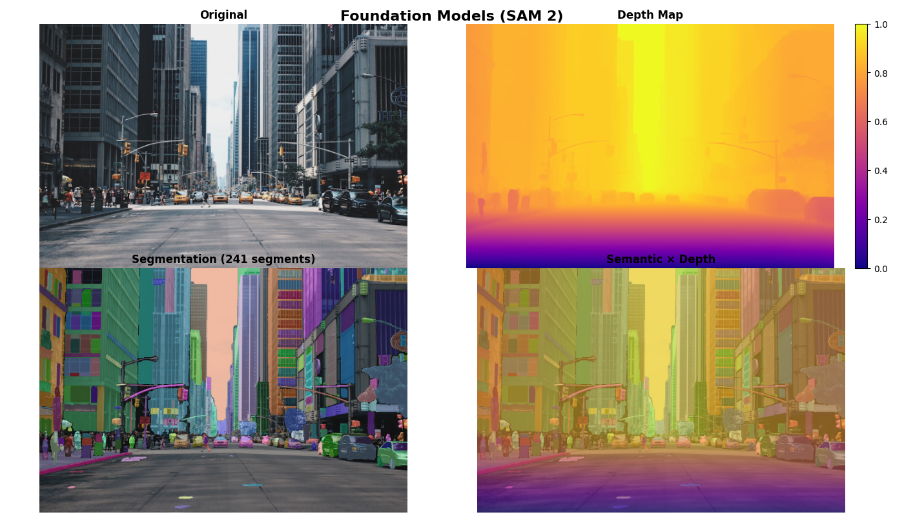

# Foundation-Models-for-3D-Semantic-Scene-Understanding
SAM 2 × Depth Anything V2

This project demonstrates single-image 3D semantic understanding by combining state-of-the-art foundation models for semantic segmentation and monocular depth estimation.

Using only an RGB image, the system produces:

1) Instance-level semantic segmentation

2) Dense depth estimation

3) Semantic × depth fusion for 3D scene reasoning

## Research Foundations

This project is an **engineering implementation and system-level integration**
based on the ideas and methodologies proposed in the following research works:

- **Depth Anything V2**  
  *Depth Anything V2: Robust Monocular Depth Estimation*  
  Paper: https://arxiv.org/pdf/2406.09414  
  This work introduces a scalable and robust approach to monocular depth
  estimation using large-scale data and strong visual priors.

- **SAM 2 (Segment Anything Model v2)**  
  *Segment Anything in Images and Videos*  
  Paper: https://arxiv.org/abs/2408.00714  
  This work extends the Segment Anything paradigm with improved architectural
  design and stronger generalization across visual domains.

## Key Features

1) SAM 2 (Segment Anything Model v2) for high-quality instance segmentation

2) Depth Anything V2 for state-of-the-art monocular depth estimation

3) Semantic × Depth Fusion enabling object-level geometric reasoning

4) Robust fallback mechanisms (MiDaS, classical segmentation)

5) Modular, extensible pipeline design

**Note**:  
This repository **does not reimplement the original models from scratch**.
Instead, it demonstrates how modern **foundation models** can be combined
to enable **3D semantic scene understanding from a single RGB image**.
